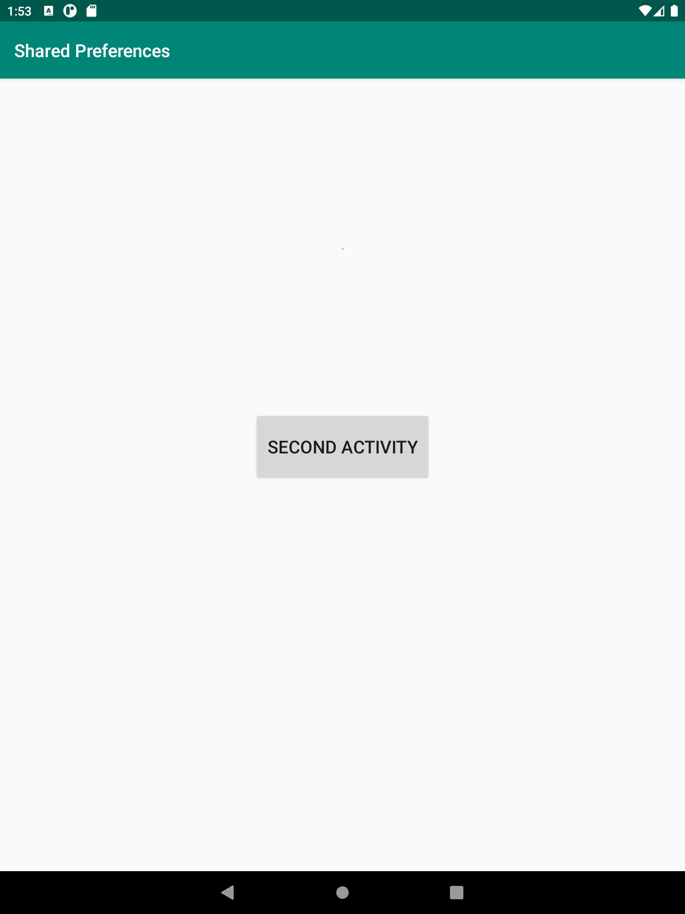
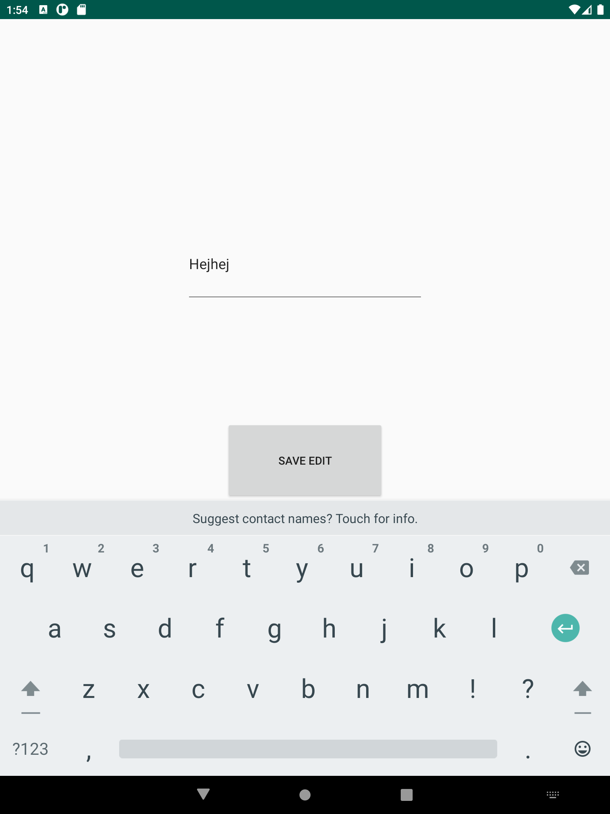
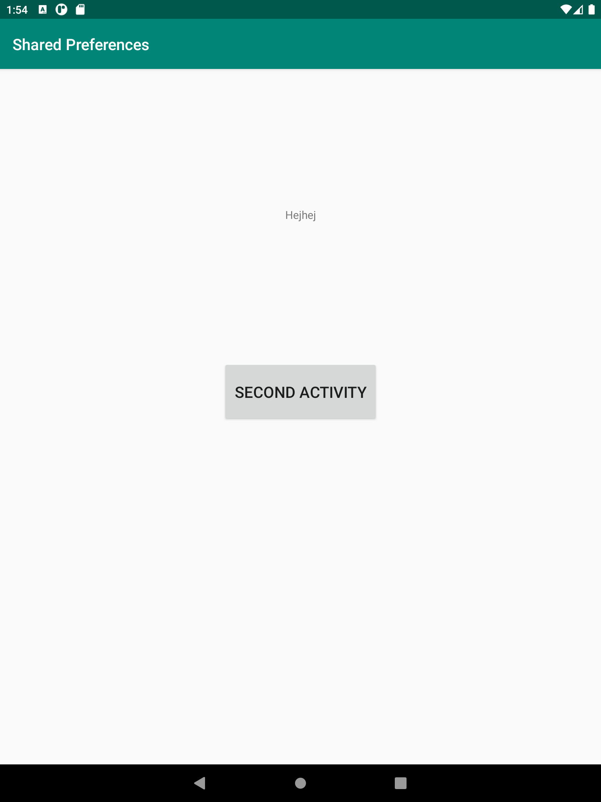

# Rapport

Ett enkelt program som startar en aktivitet med en knapp för att ta sig till andra aktiviteten. I andra aktiviteten finns det en edit text
där användaren själv får välja vad som ska stå i första aktiviteten när appen startas om.

Första aktiviteten startar med en oncreate, där en text field existerar samt en knapp med en onClick metod.
```java
button.setOnClickListener(new View.OnClickListener() {
            @Override
            public void onClick(View v) {
                Intent intent = new Intent(MainActivity.this, SecondActivity.class);
                startActivity(intent);
            }
        });
```

andra aktiviteten sätter upp sharedpreferences där en text redigerare existerar samt en knapp för att spara
informationen.
```java
button.setOnClickListener(new View.OnClickListener() {
@Override
public void onClick(View v) {

                editor = sharedPreferences.edit();
                editor.putString("textInput", editText.getText().toString());
                editor.apply();
            }
        });
```

Detta i sin tur redigerar textView i activity_main xml som visas inuti första aktiviteten.
```xml
<TextView
        android:id="@+id/textView"
        android:layout_width="wrap_content"
        android:layout_height="wrap_content"
        android:text="@string/app_name"
        app:layout_constraintBottom_toTopOf="@+id/activityButton"
        app:layout_constraintEnd_toEndOf="parent"
        app:layout_constraintStart_toStartOf="parent"
        app:layout_constraintTop_toBottomOf="@+id/appBarLayout" />
```

Där koden i onResume ser till att den redigerade texten blir sparad.
```java
protected void onResume() {
        super.onResume();
        SharedPreferences sharedPreferences = getApplicationContext().getSharedPreferences("SharedPreferences", Context.MODE_PRIVATE);
        String textInput = sharedPreferences.getString("textInput", "");

        textView = findViewById(R.id.textView);
        textView.setText(textInput);
    }
```
Första aktiviteten:

Andra aktiviteten:

Första aktiviteten efter redigerad text:


